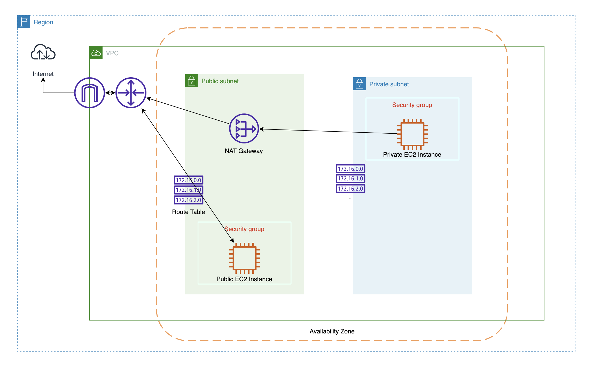

# Infrastructure

참고) https://registry.terraform.io/providers/hashicorp/aws/latest/docs

## Basic Usage
1. `terraform init`
2. `terraform plan`
3. `terraform apply`
4. 확인하고 `yes` 입력

command 테스트 혹은 확인하고 싶으면 `terraform console`